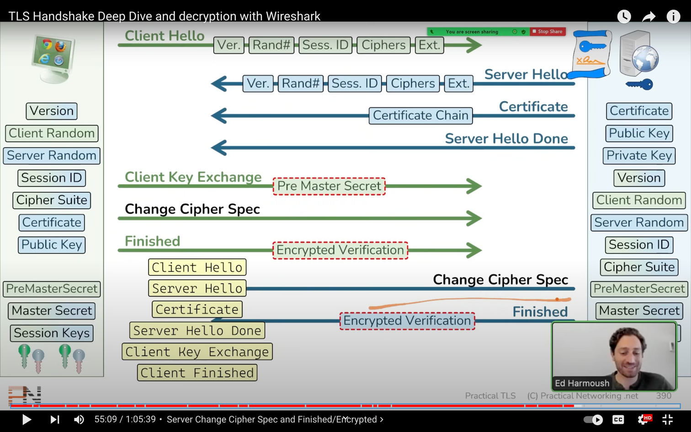

飞书文档：https://a08imyjk6va.feishu.cn/wiki/PqLnw7EeOigJtIkfB7fcvDCsn3d
- [x] websocket 
 抓开源实现的包
- [x] https 
借助go tls库实现的
- [x] ftp
 抓 QuickFTP 的包
- [x] hls 
 参考 https://www.jianshu.com/p/2ce402a485ca
- [x] rtsp 
 参考 https://www.rtcdeveloper.cn/cn/community/blog/23145
 抓 vlc 推流与播放的包
 https://www.bilibili.com/video/BV18P4y1X78w
- [x] ssh 
 推荐文档 https://www.cnblogs.com/softidea/p/4550552.html
- [x] smtp
  也需要使用 tls 加密，smtp协议本身是纯文本协议，但是
太不安全了现有的邮件服务器都是要加tls才能使用的
- [x] mysql
 本地安装 mysql 抓包即可
## 推荐使用 华为模拟器Ensp
tls是一个庞大的家族先考虑使用开源实现吧 
tls是ssl的升级版本修复了ssl中的一些安全问题，
现在都是使用的tls不过一些历史原因仍然有ssl的叫法
值太难算了，tls先使用开源实现
ssh也实现不了，跟tls不是一个东西
 可以参考 sshj 的实现
 tls资料 https://hpbn.co/transport-layer-security-tls/
同一个客服端主机的tls session会复用，服务端需要缓存相关 session信息

https://www.youtube.com/watch?v=25_ftpJ-2ME
https://tls12.xargs.org/

推荐文章：https://hpbn.co/ 
跨域请求是浏览器的保护策略，若是开启跨域浏览器会自动携带
Origin 头，若是对方允许跨域访问可以设置 Access-Control-Allow-Origin 头来回应
响应没有该头会跨域失败